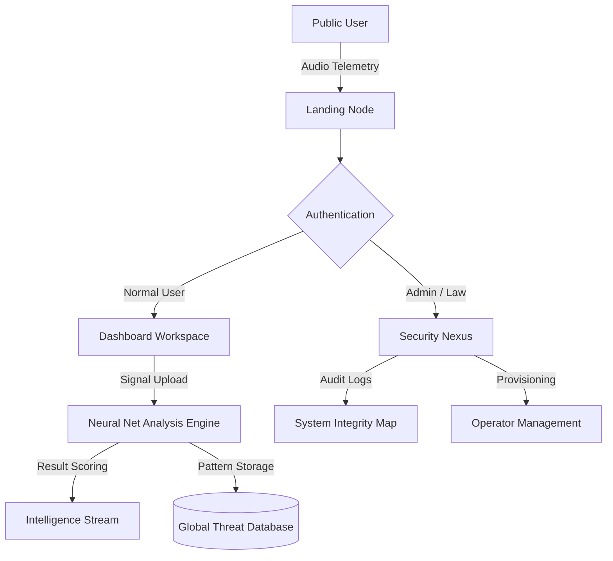

# 🛡️ Chakravyuh | AI-Powered Phone Scam Detection


**Chakravyuh** is a professional, high-fidelity signal intelligence platform designed to detect, analyze, and neutralize telephone-based scams. Built with a premium "Digital Bastion" aesthetic, it leverages AI-driven acoustic analysis to protect users from deceptive communication.

---

## ✨ Core Features

### 📡 Signal Intelligence (SI)
- **Neural Audio Scanning**: Upload audio recordings for real-time decomposition and pattern recognition.
- **Threat Scoring**: Instantaneous probability metrics for detecting scams, linguistic manipulation, and biometric harvesting.
- **Intelligence Stream**: Live dashboard tracking "Risk Incursions" and "Neutralized Scams" with millisecond-accuracy logs.

### 🏛️ Digital Bastion Interface
- **Glassmorphism UI**: A high-tech, dark-themed command center built with TailwindCSS and custom neon accents.
- **Interactive Dashboards**: Role-specific workspaces tailored for **Normal Users**, **System Admins**, and **Law Enforcement Agents**.
- **Real-Time Polling**: Asynchronous analysis updates ensuring no delay in threat identification.

### 🔐 Zero-Trust Security
- **Multi-Tier RBAC**: Strict role-based dashboards isolating patient/user data from investigative investigative tools.
- **2FA (OTP) Integration**: Two-factor authentication via TOTP (QR Code) for all administrative and legal nodes.
- **Secure Provisioning**: Dedicated internal provisioning portal for onboarding certified operators.

---

## 🏗️ System Architecture



---

## 💻 Tech Stack

- **Backend**: Python 🐍, Django (REST, ORM, Auth)
- **Frontend**: TailwindCSS (Modern Grid, Glassmorphism, Neon Glow)
- **Security**: Django-OTP (TOTP), CSRF Protection, Multi-layered RBAC
- **Icons/Fonts**: Google Material Symbols, Space Grotesk, Inter
- **Data Visualization**: Custom CSS Visualizers, Mermaid.js

---

## 🚀 Rapid Deployment

### 1. Repository Setup
```bash
# Clone the repository
git clone https://github.com/yourusername/chakravyuh.git
cd chakravyuh
```

### 2. Environment Configuration
```bash
# Initialize virtual environment
python -m venv venv
source venv/bin/activate  # On Windows: venv\Scripts\activate

# Install dependencies
pip install -r requirements.txt
```

### 3. Database Initialization
```bash
python manage.py makemigrations
python manage.py migrate
```

### 4. Admin Provisioning
```bash
# Create a superuser for the Security Nexus
python manage.py createsuperuser
```

### 5. Launch the Command Center
```bash
python manage.py runserver
```
Visit `http://127.0.0.1:8000/` to initialize.

---

## 📸 Interface Preview

- **Landing Page**: Immersive "Digital Guardian" hero section with interactive technology nodes.
- **Intelligence Dashboard**: Real-time signal analysis with live probability scores and risk indicators.
- **Provisioning Portal**: Minimalist, high-intensity interface for administrative account management.

---


